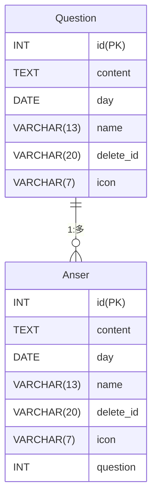

```mermaid
erDiagram

Question ||--o{ Anser: "1:多"

Question{
INT id(PK)
TEXT content
DATE day
VARCHAR(13) name
VARCHAR(20) delete_id
VARCHAR(7) icon
}

Anser{
INT id(PK)
TEXT content
DATE day
VARCHAR(13) name
VARCHAR(20) delete_id
VARCHAR(7) icon
INT question
}
```
