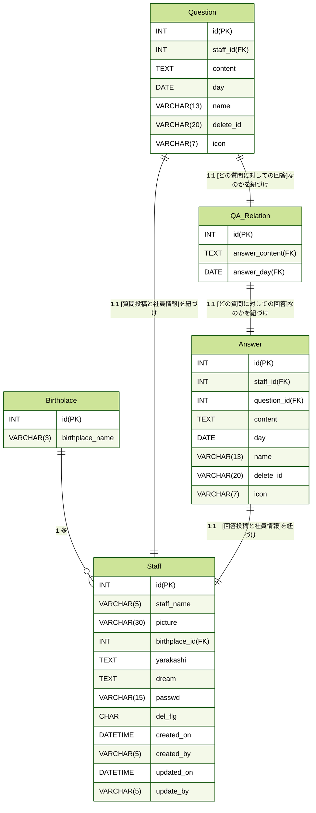

```mermaid

%%{init:{'theme':'forest'}}%%
erDiagram


Birthplace ||--o{ Staff: "1:多"
Question ||--|| Staff: "1:1 [質問投稿と社員情報]を紐づけ"
Answer ||--|| Staff: "1:1　[回答投稿と社員情報]を紐づけ"
Question ||--|| QA_Relation: "1:1 [どの質問に対しての回答]なのかを紐づけ"
QA_Relation ||--|| Answer: "1:1 [どの質問に対しての回答]なのかを紐づけ"

Question{
INT id(PK)
INT staff_id(FK)
TEXT content
DATE day
VARCHAR(13) name
VARCHAR(20) delete_id
VARCHAR(7) icon
}

Answer{
INT id(PK)
INT staff_id(FK)
INT question_id(FK)
TEXT content
DATE day
VARCHAR(13) name
VARCHAR(20) delete_id
VARCHAR(7) icon
}

Staff{
 INT id(PK)
 VARCHAR(5) staff_name
 VARCHAR(30) picture
 INT birthplace_id(FK)
 TEXT yarakashi
 TEXT dream
 VARCHAR(15) passwd
 CHAR del_flg
 DATETIME created_on
 VARCHAR(5) created_by
 DATETIME updated_on
 VARCHAR(5) update_by
}

Birthplace{
INT id(PK)
VARCHAR(3) birthplace_name
}

QA_Relation{
INT id(PK)
TEXT answer_content(FK)
DATE answer_day(FK)
}

```

